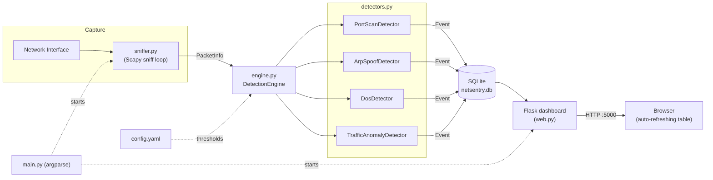

# NetSentry

**NetSentry** is a lightweight, Python-based Network Intrusion Detection
System (NIDS). It watches live network traffic with [Scapy](https://scapy.net/),
detects common attack patterns in real time, logs them to a local SQLite
database, and surfaces them on a self-refreshing Flask dashboard.

> ⚠️ **Legal / ethical disclaimer**
>
> NetSentry captures and inspects live network traffic. **Only run it on
> networks and systems you own, or where you have explicit, documented
> authorization to monitor.** Capturing traffic on networks you do not
> control or lack permission to monitor may violate the law (e.g. wiretapping
> / computer misuse statutes) and the policies of your organization or ISP.
> This project is provided for educational and authorized security-testing
> purposes only. The authors and contributors accept no liability for misuse.

---

## Features

NetSentry ships with four independent detectors, each individually
configurable and individually toggleable:

| Detector | What it catches | Signal |
|---|---|---|
| **Port Scan** | A single IP probing many distinct ports in a short window | ≥ *N* distinct destination ports from one source IP within *T* seconds |
| **ARP Spoofing** | ARP cache poisoning / MITM setup | One IP address observed bound to more than one MAC address |
| **SYN Flood / Basic DoS** | Volumetric TCP SYN flood | ≥ *N* SYN packets from one source IP within *T* seconds |
| **Traffic Anomaly** | General statistical spikes in traffic volume | Packets-per-window exceeding *X*× the rolling baseline average |

Every detected event is persisted with a timestamp, source IP, event type,
and a human-readable details string, and is immediately visible on the live
dashboard.

---

## Architecture



Design notes:

- **`sniffer.py`** is the *only* module that imports Scapy. It converts raw
  Scapy packets into a protocol-agnostic `PacketInfo` dataclass
  (`src/packet_info.py`).
- Detectors never see Scapy objects — they only consume `PacketInfo`, which
  makes them trivial to unit test with plain Python objects (no capture
  privileges needed to run the test suite).
- The `DetectionEngine` (`src/engine.py`) fans each packet out to every
  active detector, persists any resulting `Event` objects to SQLite via
  `src/database.py`, and logs them.
- The Flask app (`src/web.py`) is a thin read-only layer over the same
  SQLite database; the dashboard page polls `/api/events` and `/api/stats`
  on an interval.

### Project layout

```
netsentry/
├── main.py                     # CLI entry point (argparse)
├── config.yaml                 # Threshold / runtime configuration
├── requirements.txt
├── src/
│   ├── config.py                # Typed config dataclasses + YAML loader
│   ├── packet_info.py            # Protocol-agnostic packet representation
│   ├── sniffer.py                # Scapy capture + packet parsing
│   ├── engine.py                 # Wires detectors + database together
│   ├── database.py               # SQLite event storage
│   ├── logging_config.py         # Console + rotating file logging
│   ├── detectors.py              # Detector interface + all four detectors
│   ├── web.py                    # Flask app, JSON API, self-signed TLS setup
│   └── templates/
│       └── dashboard.html
└── tests/
    ├── conftest.py                # Shared fixtures / mock packet builder
    ├── test_port_scan.py
    ├── test_arp_spoof.py
    ├── test_dos_detect.py
    ├── test_traffic_anomaly.py
    ├── test_database.py
    ├── test_config.py
    ├── test_sniffer.py
    ├── test_engine.py
    └── test_web_app.py
```

---

## Installation

Requires **Python 3.10+**.

```bash
git clone <this-repo-url>
cd netsentry
python -m venv .venv
source .venv/bin/activate        # Windows: .venv\Scripts\activate
pip install -r requirements.txt
```

Live packet capture additionally requires:

- **Linux/macOS**: `libpcap` (usually preinstalled) and root privileges
  (`sudo`), or the `CAP_NET_RAW`/`CAP_NET_ADMIN` capabilities on the Python
  interpreter.
- **Windows**: [Npcap](https://npcap.com/) installed, and running your shell
  as Administrator.

You do **not** need any of the above to run the test suite or browse the
dashboard against an existing database — only to capture live traffic.

---

## Usage

### List available interfaces

```bash
python main.py --list-interfaces
```

### Capture traffic with every detector active

```bash
# Linux/macOS
sudo python main.py -i eth0

# Windows (run terminal as Administrator)
python main.py -i "Ethernet"
```

### Capture + live dashboard together

```bash
sudo python main.py -i eth0 --web
```

Then open the dashboard in a browser. The table refreshes automatically
(interval configurable via `web.refresh_interval` in `config.yaml`).

#### Dashboard access

The dashboard is served over HTTPS and protected with HTTP Basic Auth. The
credentials and TLS setting live in `config.yaml` under the `web` section:

```yaml
web:
  https: true
  username: admin
  password: "..."
```

To change the username or password, edit those two values in `config.yaml`
and restart the dashboard — no code changes needed. Auth is disabled if
`username`/`password` are left empty. Never commit real credentials to
version control.

### Only run specific detectors

```bash
sudo python main.py -i eth0 --detectors port_scan,dos
```

Valid detector names: `port_scan`, `arp_spoof`, `dos`, `traffic_anomaly`.

### Browse an existing database without capturing

```bash
python main.py --web-only
```

### Use a custom config file

```bash
sudo python main.py -i eth0 -c my-config.yaml
```

### Full CLI reference

```bash
python main.py --help
```

```
-i, --interface       Network interface to capture on
-c, --config          Path to YAML config file (default: config.yaml)
--detectors            Comma-separated detector names to enable
--bpf-filter            BPF filter for capture (default: "ip or arp")
--web                   Also start the dashboard alongside capture
--web-only              Only run the dashboard (no capture)
--list-interfaces       List available interfaces and exit
--version               Print version and exit
```

### Dashboard preview

```
+--------------------------------------------------------------------+
|  NetSentry — Live Dashboard                        ● updated 10:42 |
+--------------------------------------------------------------------+
|  Total Events: 12   Port Scans: 4   ARP: 2   SYN: 3   Anomaly: 3   |
+--------------------------------------------------------------------+
| Timestamp           | Source IP     | Type            | Details    |
|----------------------|---------------|-----------------|------------|
| 2026-08-16T10:41:02Z | 192.168.1.50  | PORT_SCAN       | 22 ports…  |
| 2026-08-16T10:40:55Z | 192.168.1.77  | ARP_SPOOF       | 2 MACs…    |
+--------------------------------------------------------------------+
```

*(Replace this block with an actual screenshot: `docs/screenshot.png`, then
embed it here with ``.)*

---

## Configuration

All thresholds live in `config.yaml`. Any key you omit falls back to the
built-in default — see `src/config.py` for the full set. Example:

```yaml
port_scan:
  enabled: true
  port_threshold: 15   # distinct ports within the window to trigger
  time_window: 10       # seconds
  cooldown: 30           # seconds between repeat alerts per IP

dos:
  enabled: true
  syn_threshold: 100
  time_window: 5
  cooldown: 30

traffic_anomaly:
  enabled: true
  window_seconds: 10
  baseline_windows: 6
  multiplier: 3.0
  min_baseline_samples: 3

web:
  host: 127.0.0.1
  port: 5000
  refresh_interval: 5
```

---

## Testing

The full test suite runs entirely offline against synthetic packet data —
no live capture, no root/Administrator privileges, and no real network
required.

```bash
pip install -r requirements-dev.txt
pytest -q
```

Each detector has a dedicated test file (`tests/test_<detector>.py`)
covering both the "should not alert" and "should alert" paths, plus edge
cases like sliding-window expiry and per-IP isolation. `tests/test_sniffer.py`
crafts real Scapy packets in memory to validate packet parsing without
touching a network interface.

---

## How each detector works

All four live in `src/detectors.py`:

- **Port Scan** (`PortScanDetector`): maintains a per-source-IP map of
  `{port: last_seen_timestamp}`, prunes entries older than the configured
  window on every packet, and alerts once the number of live entries
  reaches the threshold.
- **ARP Spoofing** (`ArpSpoofDetector`): maintains a per-IP map of
  `{MAC: last_seen_timestamp}` from observed ARP traffic; alerts as soon as
  a second MAC appears for the same IP.
- **SYN Flood** (`DosDetector`): maintains a per-source-IP sliding-window
  deque of SYN packet timestamps; alerts once the count within the window
  crosses the threshold.
- **Traffic Anomaly** (`TrafficAnomalyDetector`): buckets *all* traffic into
  fixed-size time windows, keeps a rolling average of the last *N* completed
  windows as a baseline, and alerts when a window's packet count exceeds
  `multiplier × baseline average`.

All detectors implement per-source cooldowns so a sustained attack produces
one alert per cooldown period rather than one per packet.

---

## License

[MIT](LICENSE)

---

Made by **Deipedra**
